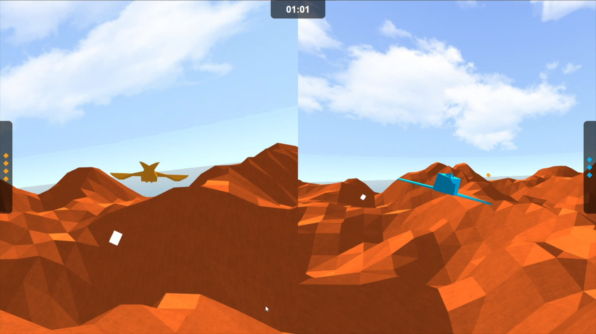

# Escape Velocity - WebGL

## How to run
Start a simple server in the root folder and open the index.html file in a browser.

## How to play
The goal of the game is to conquer more checkpoints than your opponent in the given time. Checkpoints can be conquered by flying through them, however your opponent can take them back. Spaceships are also equipped with lasers. By hitting the opponent, they will respawn on a random location on the map and will be unable to move for the next three seconds.

